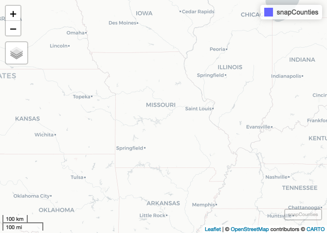
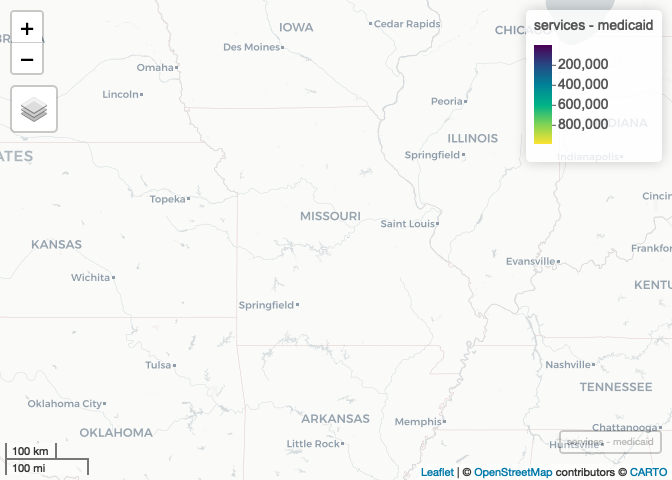

Lab-05 Replication Notebook
================
Christopher Prener, Ph.D.
(March 01, 2021)

``` r
knitr::opts_chunk$set(cache = FALSE)
```

## Introduction

This is the replication notebook for Lab-05 from the course SOC
4650/5650: Introduction to GISc.

## Load Dependencies

The following code loads the package dependencies for our analysis:

``` r
# tidyverse packages
library(dplyr)      # data wrangling
```

    ## 
    ## Attaching package: 'dplyr'

    ## The following objects are masked from 'package:stats':
    ## 
    ##     filter, lag

    ## The following objects are masked from 'package:base':
    ## 
    ##     intersect, setdiff, setequal, union

``` r
# spatial packages
library(mapview)    # preview spatial data
```

    ## GDAL version >= 3.1.0 | setting mapviewOptions(fgb = TRUE)

``` r
library(sf)         # spatial data tools
```

    ## Linking to GEOS 3.8.1, GDAL 3.1.4, PROJ 6.3.1

``` r
library(tidycensus) # data wrangling
library(tigris)     # data wrangling
```

    ## To enable 
    ## caching of data, set `options(tigris_use_cache = TRUE)` in your R script or .Rprofile.

``` r
# other packages
library(here)       # file path tools
```

    ## here() starts at /Users/chris/GitHub/slu-soc5650/content/module-2-combine-sources/assignments/lab-05-replication

## Part 1

### Question 1

First, we’ll download and preview the variables using the
`load_variables()` function from `tidycensus`.

``` r
acs <- load_variables(2019, "acs5", cache = TRUE)
```

The variables we need represent:

-   `"PUBLIC ASSISTANCE INCOME OR FOOD STAMPS/SNAP IN THE PAST 12 MONTHS FOR HOUSEHOLDS"`
-   `"MEDICAID/MEANS-TESTED PUBLIC COVERAGE BY SEX BY AGE"`

### Question 2

First, we’ll download the relevant ACS data using `get_acs()`. We get
the data for all counties by specifying `"county"` as the geography:

``` r
snapCounties <- get_acs(geography = "county", year = 2019, state = 29, 
                        variables = c("B19058_001", "B19058_002"),
                        output = "wide", geometry = TRUE)
```

    ## Getting data from the 2015-2019 5-year ACS

    ## Downloading feature geometry from the Census website.  To cache shapefiles for use in future sessions, set `options(tigris_use_cache = TRUE)`.

    ##   |                                                                              |                                                                      |   0%  |                                                                              |                                                                      |   1%  |                                                                              |=                                                                     |   1%  |                                                                              |=                                                                     |   2%  |                                                                              |==                                                                    |   2%  |                                                                              |==                                                                    |   3%  |                                                                              |===                                                                   |   4%  |                                                                              |===                                                                   |   5%  |                                                                              |====                                                                  |   5%  |                                                                              |====                                                                  |   6%  |                                                                              |=====                                                                 |   7%  |                                                                              |=====                                                                 |   8%  |                                                                              |======                                                                |   8%  |                                                                              |======                                                                |   9%  |                                                                              |=======                                                               |   9%  |                                                                              |=======                                                               |  10%  |                                                                              |=======                                                               |  11%  |                                                                              |========                                                              |  11%  |                                                                              |========                                                              |  12%  |                                                                              |=========                                                             |  12%  |                                                                              |=========                                                             |  13%  |                                                                              |=========                                                             |  14%  |                                                                              |==========                                                            |  14%  |                                                                              |==========                                                            |  15%  |                                                                              |===========                                                           |  15%  |                                                                              |===========                                                           |  16%  |                                                                              |============                                                          |  16%  |                                                                              |============                                                          |  17%  |                                                                              |============                                                          |  18%  |                                                                              |=============                                                         |  18%  |                                                                              |=============                                                         |  19%  |                                                                              |==============                                                        |  19%  |                                                                              |==============                                                        |  20%  |                                                                              |==============                                                        |  21%  |                                                                              |===============                                                       |  21%  |                                                                              |===============                                                       |  22%  |                                                                              |================                                                      |  22%  |                                                                              |================                                                      |  23%  |                                                                              |================                                                      |  24%  |                                                                              |=================                                                     |  24%  |                                                                              |=================                                                     |  25%  |                                                                              |==================                                                    |  25%  |                                                                              |==================                                                    |  26%  |                                                                              |===================                                                   |  27%  |                                                                              |===================                                                   |  28%  |                                                                              |====================                                                  |  28%  |                                                                              |====================                                                  |  29%  |                                                                              |=====================                                                 |  29%  |                                                                              |=====================                                                 |  30%  |                                                                              |=======================                                               |  34%  |                                                                              |========================                                              |  34%  |                                                                              |========================                                              |  35%  |                                                                              |=========================                                             |  35%  |                                                                              |=========================                                             |  36%  |                                                                              |==========================                                            |  37%  |                                                                              |==========================                                            |  38%  |                                                                              |===========================                                           |  38%  |                                                                              |===========================                                           |  39%  |                                                                              |============================                                          |  39%  |                                                                              |============================                                          |  40%  |                                                                              |============================                                          |  41%  |                                                                              |=============================                                         |  41%  |                                                                              |=============================                                         |  42%  |                                                                              |==============================                                        |  42%  |                                                                              |==============================                                        |  43%  |                                                                              |===============================                                       |  44%  |                                                                              |==================================                                    |  48%  |                                                                              |==================================                                    |  49%  |                                                                              |===================================                                   |  49%  |                                                                              |===================================                                   |  50%  |                                                                              |===================================                                   |  51%  |                                                                              |====================================                                  |  51%  |                                                                              |====================================                                  |  52%  |                                                                              |=====================================                                 |  52%  |                                                                              |=====================================                                 |  53%  |                                                                              |=====================================                                 |  54%  |                                                                              |======================================                                |  54%  |                                                                              |==========================================                            |  59%  |                                                                              |==========================================                            |  60%  |                                                                              |==========================================                            |  61%  |                                                                              |===========================================                           |  61%  |                                                                              |===========================================                           |  62%  |                                                                              |============================================                          |  62%  |                                                                              |============================================                          |  63%  |                                                                              |============================================                          |  64%  |                                                                              |=============================================                         |  64%  |                                                                              |=================================================                     |  70%  |                                                                              |=================================================                     |  71%  |                                                                              |==================================================                    |  71%  |                                                                              |==================================================                    |  72%  |                                                                              |===================================================                   |  72%  |                                                                              |===================================================                   |  73%  |                                                                              |===================================================                   |  74%  |                                                                              |====================================================                  |  74%  |                                                                              |====================================================                  |  75%  |                                                                              |=====================================================                 |  75%  |                                                                              |=====================================================                 |  76%  |                                                                              |======================================================                |  77%  |                                                                              |=======================================================               |  79%  |                                                                              |========================================================              |  80%  |                                                                              |===========================================================           |  84%  |                                                                              |===========================================================           |  85%  |                                                                              |============================================================          |  85%  |                                                                              |============================================================          |  86%  |                                                                              |=============================================================         |  86%  |                                                                              |=============================================================         |  87%  |                                                                              |=============================================================         |  88%  |                                                                              |==============================================================        |  88%  |                                                                              |==============================================================        |  89%  |                                                                              |===============================================================       |  89%  |                                                                              |===============================================================       |  90%  |                                                                              |===============================================================       |  91%  |                                                                              |================================================================      |  91%  |                                                                              |================================================================      |  92%  |                                                                              |=================================================================     |  92%  |                                                                              |=================================================================     |  93%  |                                                                              |=================================================================     |  94%  |                                                                              |==================================================================    |  94%  |                                                                              |==================================================================    |  95%  |                                                                              |===================================================================   |  95%  |                                                                              |===================================================================   |  96%  |                                                                              |====================================================================  |  97%  |                                                                              |====================================================================  |  98%  |                                                                              |===================================================================== |  98%  |                                                                              |===================================================================== |  99%  |                                                                              |======================================================================|  99%  |                                                                              |======================================================================| 100%

We can preview our geometric data with `mapview`:

``` r
mapview(snapCounties)
```

<!-- -->

### Question 3

Next, we’ll clean our data by renaming variables:

``` r
snapCounties %>%
  rename(
    total_pop = B19058_001E,
    total_pop_moe = B19058_001M,
    snap = B19058_002E,
    snap_moe = B19058_002M
  ) -> snapCounties
```

## Part 2

### Question 4

Next, we’ll download the relevant ACS data for Medicaid using
`get_acs()`:

``` r
medicaidCounties <- get_acs(geography = "county", year = 2019, state = 29, 
                        variables = c("C27007_002", "C27007_012"),
                        output = "wide", geometry = FALSE)
```

    ## Getting data from the 2015-2019 5-year ACS

Now we have the number of male and female Medicaid recipients.

### Question 5

Next, we’ll tidy up the demographic data, including by renaming
variables and summing our male and female Medicaid estimates:

``` r
medicaidCounties %>%
  rename(
    medicaid_male = C27007_002E,
    medicaid_male_moe = C27007_002M,
    medicaid_female = C27007_012E,
    medicaid_female_moe = C27007_012M
  ) %>%
  mutate(medicaid = medicaid_male + medicaid_female) %>%
  select(-NAME) -> medicaidCounties
```

Now our data are ready to join with our SNAP recipiency data!

## Part 3

### Question 6

Finally, we’ll combine our data:

``` r
services <- left_join(snapCounties, medicaidCounties, by = "GEOID")
```

To make sure things went correctly, we’ll preview our data again:

``` r
mapview(services, zcol = "medicaid")
```

<!-- -->

Our data map correctly!
